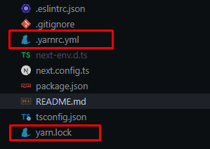

# Guía de Instalación del Proyecto

Este proyecto utiliza Yarn para la gestión de dependencias. Para instalar y poner en marcha el proyecto en tu máquina local, sigue los siguientes pasos:

## Requisitos Previos

Antes de comenzar, asegúrate de tener Node.js instalado en tu equipo. Puedes verificar si lo tienes ejecutando el siguiente comando en tu terminal:

```bash
node -v
```

Si no tienes Node.js instalado, puedes descargarlo desde su página oficial.

## Paso 1: Verificar la existencia de los archivos esenciales

Asegúrate de que los siguientes archivos estén presentes en el directorio del proyecto:

1. yarn.lock
Este archivo asegura que las versiones de las dependencias sean consistentes entre todos los miembros del equipo y los entornos de producción.

2. .yarnrc.yml
Este archivo de configuración es necesario para evitar problemas durante la instalación de módulos. Verifica que contenga lo siguiente:

```bash
imagencompressionLevel: mixed

enableGlobalCache: false

nodeLinker: node-modules
```

# Paso 2: Instalar las dependencias

Con los archivos verificados, ahora puedes proceder a instalar las dependencias del proyecto. Para ello, ejecuta el siguiente comando en tu terminal:

```bash
yarn install 
```

# Paso 3: Iniciar el proyecto

Una vez que las dependencias estén instaladas, puedes iniciar el servidor de desarrollo ejecutando:

```bash
yarn dev
```

Esto iniciará la aplicación en el servidor local, y podrás acceder a ella en el navegador.

# IMAGEN DE LOS ARCHIVOS A TENER EN CUENTA PARA CORRER EL PROYECTO 




## Getting Started

First, run the development server:

```bash
npm run dev
# or
yarn dev
# or
pnpm dev
# or
bun dev
```

Open [http://localhost:3000](http://localhost:3000) with your browser to see the result.

You can start editing the page by modifying `app/page.tsx`. The page auto-updates as you edit the file.

This project uses [`next/font`](https://nextjs.org/docs/app/building-your-application/optimizing/fonts) to automatically optimize and load [Geist](https://vercel.com/font), a new font family for Vercel.

## Learn More

To learn more about Next.js, take a look at the following resources:

- [Next.js Documentation](https://nextjs.org/docs) - learn about Next.js features and API.
- [Learn Next.js](https://nextjs.org/learn) - an interactive Next.js tutorial.

You can check out [the Next.js GitHub repository](https://github.com/vercel/next.js) - your feedback and contributions are welcome!

## Deploy on Vercel

The easiest way to deploy your Next.js app is to use the [Vercel Platform](https://vercel.com/new?utm_medium=default-template&filter=next.js&utm_source=create-next-app&utm_campaign=create-next-app-readme) from the creators of Next.js.

Check out our [Next.js deployment documentation](https://nextjs.org/docs/app/building-your-application/deploying) for more details.
